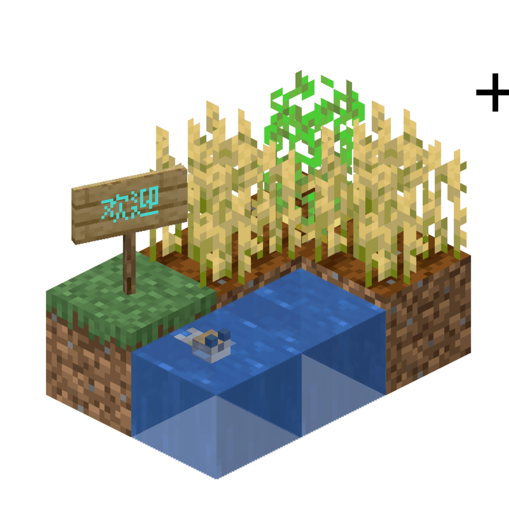

# Mineplace

    

> "This project is part of the **Fancy Junk** series: Over-engineered solutions for non-existent problems."

[前往这里](https://star-whisper9.github.io/mineplace) 查看 GitHub Pages 托管的在线版本。

一个以 Minecraft 为场景的 WebGL 3D 场景，使用 Three.js 实现。**本项目是几乎纯 AI 的对原推的拙劣模仿，仅供娱乐。我不对代码质量做任何保证！**

> [!IMPORTANT]
> 原作者联系方式  
> GitHub：[@antonoko](http://github.com/antonoko)
> X(Twitter)：[@annaxtime](https://x.com/annaxtime)

[原推](https://x.com/annaxtime/status/2039350221092892695) 没有仓库，只有一段视频预览和一个 [在线版本](https://rive.app/s/JYlx-j85HUe7gnhW8ELdoA/embed?runtime=rive-renderer)，看上去是托管的 Rive 动画实现，我并不熟这一块，所以就用 Three.js 重现了这个场景。 ~~（虽然我也不熟 Three.js）~~

## 原推 Features 拆解

- 3D 场景，2x3x2 方块的空间
  - y=0 矩阵：草方块，耕地，耕地/水，水，耕地
  - y=1 矩阵：告示牌，随机作物，随机作物/空气，空气，随机作物
- 作物：土豆、胡萝卜、小麦、甜菜根、甜浆果随机
- 鱼：原版所有的小型鱼类随机
- 行为：
  - 自动：作物自动按 Minecraft 原版阶段生长，作物被收获后自动种植新作物，水中周期性出现和消失一条随机鱼，告示牌上是“欢迎！”以 RGB 循环色彩展示
  - 手动：鼠标指针移过成熟作物自动收获，收获产生原版掉落物（浮动和旋转），短暂时间后自动飞往鼠标指针位置被收集，点击未成熟作物进行骨粉催熟，鼠标指针移过水出现原版气泡柱粒子
- 动态的水纹理

## 此项目实现的 Features

- [x] 基本一致的 2x3x2 场景
- [x] 固定的三株作物（小麦、胡萝卜、甜浆果）
- [x] 水中周期性出现和消失一条随机鱼（仅鲑鱼、鳕鱼和未膨胀的河豚）
- [x] 骨粉催熟、作物采收（均通过鼠标单击）
- [x] 作物掉落物（浮动，自动飞向摄像机位置收集）
- [x] 动态的水纹理
- [x] 摄像机可拖拽旋转查看场景

## 未实现/做错了的 Features

> [!INFO]
> 我懒得修，夕夕

- [ ] 告示牌
- [ ] 气泡柱粒子（做到了鱼会自己缓慢吐泡泡）
- [ ] 骨粉粒子（做了但不还原原版样式）
- [ ] 作物角度放反了（旋转 45° 才是正确的）、作物交叉做错了（小麦和胡萝卜是二层交叉纹理）
- [ ] 鱼的实现是一个简版实现（UV 映射做的是缩略版，部分细节被省去）

## License

> [!IMPORTANT]
> 考虑到原版动画实现的作者尚未声明许可（也可能是我没有找到），若你希望使用、转载此项目或是原版，最好注明和联系原作者。

而此项目的代码部分（不含素材），基本完全由 AI 生成，以 [WTFPL](LICENSE) 许可发布，**你可以随意使用、修改、转载，甚至不注明来源（虽然注明会很棒）**。

此项目的素材部分（Minecraft 纹理）的著作权属于 Mojang Studios，遵循其原始发布许可。
